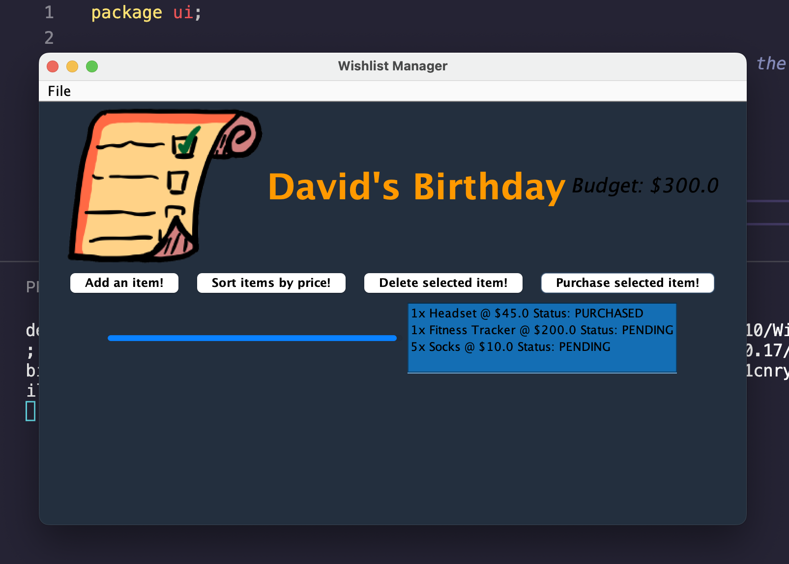
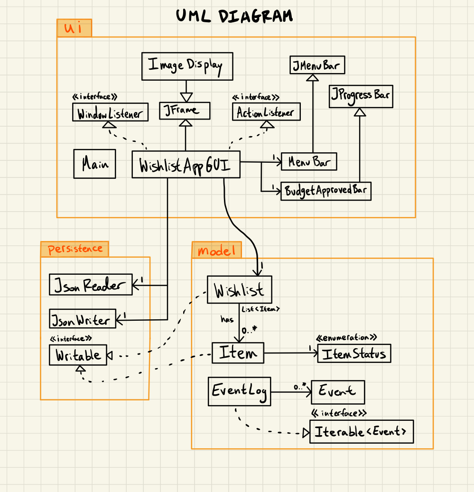

># 
 Wishlist Manager by Derek 

  

## Project Overview

I often feel lost shopping online, whether that be due to me trying to adhere to a set budget or feeling like 
there are too many items that I want to buy. This application will allow the user to create and keep track of a
`wishlist`. My wishlist will store various items that can be assigned attributes (such as priority, cost, and where to
buy). My hope in creating this application is to ease the stress that comes with online shopping so that everyone can
have a more relaxing time. 

## Objectives:

- As a user, I want to be able to `create and add an arbitrary number of items it to a wishlist`
- As a user, I want to be able to delete an item from a wishlist
- As a user, I want to be able to select an item in a wishlist and edit its attributes (name, price, or quantity)
- As a user, I want to be able to sort the items in a wishlist based on their price
- As a user, I want to be able to see the total costs within a wishlist
- As a user, I want to be able to make sure that I can't add items to the wishlist when I've exceeded my budget
- As a user, I want to have the option to either save the wishlist to a file or not when quitting the application
- As a user, when I start the application, I want to be given the option to load my wishlist from a file

# How to use:

- You can generate the first required action related to adding Xs to a Y by clicking on the `Add an item!` button
- You can generate the second required action related to adding Xs to a Y by clicking on the `Sort items by price!` button
- You can locate my visual component by looking to the left of the items panel where there is a progress bar that describes
    how much of the budget is used. In addition, if you exceed your budget, there is a special image that is displayed.
- You can save the state of my application by clicking on the `File` menu and then clicking `Save` in the dropdown menu
- You can reload the state of my application by clicking on the `File` menu and then clicking `Load` in the dropdown menu

## Sample event log:

Wed Apr 12 16:11:23 PDT 2023: Created a new item: Sake

Wed Apr 12 16:11:23 PDT 2023: Added 3x Sake @ $40.0 Status: PENDING to Trip to Japan

Wed Apr 12 16:11:44 PDT 2023: Created a new item: Figurines

Wed Apr 12 16:11:44 PDT 2023: Added 2x Figurines @ $45.0 Status: PENDING to Trip to Japan

Wed Apr 12 16:12:47 PDT 2023: Created a new item: Camera

Wed Apr 12 16:12:47 PDT 2023: Added 1x Camera @ $500.0 Status: PENDING to Trip to Japan

Wed Apr 12 16:13:34 PDT 2023: Created a new item: Shoes

Wed Apr 12 16:13:34 PDT 2023: Added 1x Shoes @ $250.0 Status: PENDING to Trip to Japan

Wed Apr 12 16:13:53 PDT 2023: Created a new item: Glasses

Wed Apr 12 16:13:53 PDT 2023: Added 1x Glasses @ $100.0 Status: PENDING to Trip to Japan

Wed Apr 12 16:13:53 PDT 2023: Budget of $1000.0 has been exceeded

Wed Apr 12 16:14:16 PDT 2023: Shoes has been deleted from Trip to Japan

Wed Apr 12 16:14:20 PDT 2023: Trip to Japan's items have been sorted by price.

Wed Apr 12 16:14:35 PDT 2023: Item Figurines status has been set to PURCHASED

Wed Apr 12 16:14:35 PDT 2023: Item Glasses status has been set to PURCHASED

Wed Apr 12 16:14:35 PDT 2023: Item Sake status has been set to PURCHASED

Wed Apr 12 16:14:35 PDT 2023: Item Camera status has been set to PURCHASED

Wed Apr 12 16:15:40 PDT 2023: Created a new item: Pudding

Wed Apr 12 16:15:40 PDT 2023: Added 5x Pudding @ $1.0 Status: PENDING to Trip to Japan

Wed Apr 12 16:15:43 PDT 2023: Item Pudding status has been set to PURCHASED

## Future improvements:
I would refactor accordingly to improve the design:

### Increase cohesion in WishlistAppGUI:
Currently, WishlistAppGUI is in charge of saving/reading from file, combining components into a GUI, and managing the wishlist itself. This violates the Single Responsibility Principle, as the WishlistAppGUI should really only be in charge of displaying the current state of the wishlist. 

To improve cohesion in WishlistAppGUI, I would create two new classes. One of them would be called `FileManager` which would be made by extracting the JsonReader and JsonWriter fields in WishlistAppGUI into their own class. The other class would be called `InputManager`, which would be created by extracting the various methods in WishlistAppGUI that handle button presses and user input. Doing so would also reduce code duplication and improve code readability, not to mention increasing cohesion in the respective classes.

### Decrease coupling between Wishlist and components in Java Swing GUI:
There is lots of coupling between the wishlist and the components relates to my programs GUI. I have many methods in WishlistAppGUI that update the GUI components whenever a change in the wishlist is made. As a result, I have several methods to update each component, but are all managed separately.

Implementing the `Observer` design pattern would work well in this situation. In this case, I would have my wishlist extend a new abstract class called Subject. Subject would have a list of observers, where observer is an interface. Finally, I would have all my GUI components implement observer so that each observer would have their own update method. Now, whenever the state of wishlist changes, it will be much easier to update all the different components at once instead of individually.

Using this design pattern would make future improvement to my GUI easier since adding another observer is as simple as adding another item to a list. Similarly, the readability of my project would increase since it will be clear where I am updating observers in my program which would make finding bugs and future collaboration easier.

### Citations

Image of DJ Khaled:
Young, A. (2019, June 10). DJ Khaled threatening to sue Billboard after his latest album fails to go No. 1. Consequence.
https://consequence.net/2019/06/dj-khaled-billboard-lawsuit/
